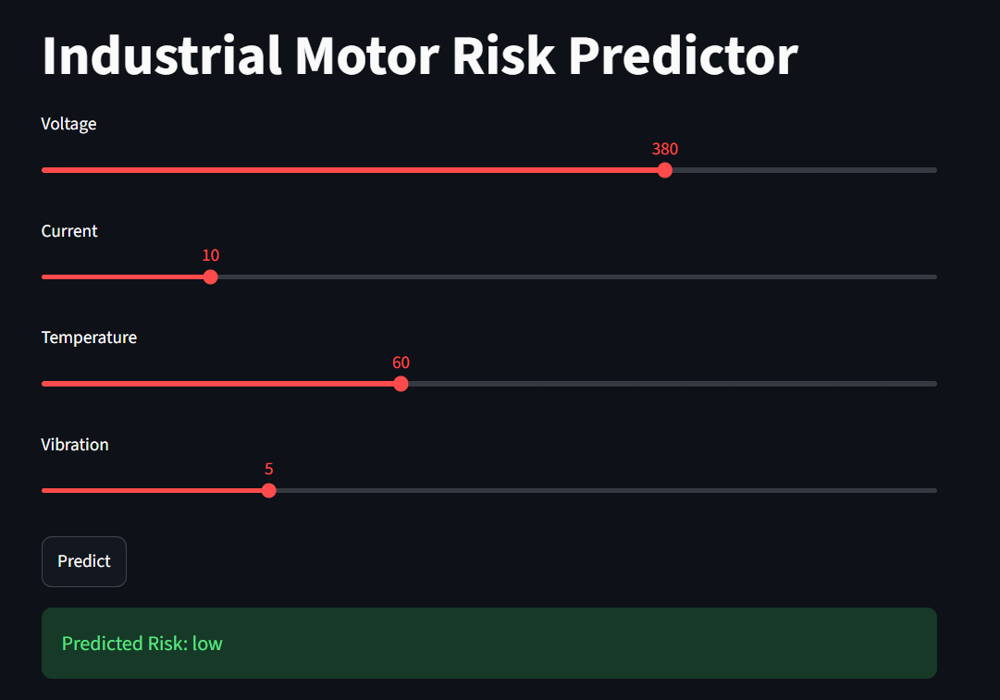
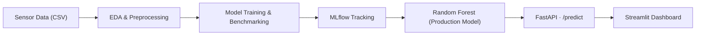

# Industrial Motor Risk Predictor

> End-to-end machine learning system for early risk classification of industrial electric motors, based on real-time electrical and mechanical sensor readings.

[](https://github.com/IsaacMartins12/predictive-maintenance-motor-ml/actions/workflows/ci.yml)
[](https://github.com/IsaacMartins12/predictive-maintenance-motor-ml/actions/workflows/train.yml)
[](https://www.python.org/)
[](https://fastapi.tiangolo.com/)
[](https://scikit-learn.org/)
[](https://mlflow.org/)
[](https://www.docker.com/)
[](#-license)

---

## Overview



Unplanned downtime is one of the most expensive problems in industrial production, and motor failure is one of its most common causes. This project implements a complete ML pipeline, from raw sensor data to a deployed prediction service, that classifies an electric motor's operational risk level (`normal`, `low`, `moderate`, `high`) from four readings: **voltage, current, temperature, and vibration**.

The focus isn't just training a model, it's the full lifecycle: exploratory analysis → model benchmarking → explainability → deployment behind a REST API and a dashboard.

## Architecture



## Dataset

| Feature | Unit | Range |
|---|---|---|
| Voltage | V | 200 – 480 |
| Current | A | 0 – 50 |
| Temperature | °C | 30 – 120 |
| Vibration | mm/s | 0 – 30 |

- **8,000 samples**, perfectly balanced across 4 classes (2,000 each): `low`, `normal`, `moderate`, `high`.
- Labels follow a rule-based logic dominated by temperature and vibration thresholds, with current resolving the `low` / `normal` boundary.

[[Dataset Link](https://www.kaggle.com/datasets/danielpetrova/industrial-motor-data/data)]

## Models Evaluated

| Model | F1 (weighted) |
|---|---|
| **Random Forest** ✅ | 1.000 |
| XGBoost | 0.999 |
| Decision Tree | 0.999 |
| Logistic Regression | 0.893 |

- **Validation:** 5-fold stratified cross-validation - `0.9999 ± 0.0003` F1 for Random Forest.
- **Production choice:** Random Forest - best score, fast inference, no feature scaling required, and native multiclass support without label encoding.

## Explainability

Feature importance (Random Forest, impurity-based):

| Feature | Importance |
|---|---|
| Vibration | 32.8% |
| Temperature | 32.5% |
| Voltage | 18.7% |
| Current | 16.0% |

SHAP values were used to cross-check feature importance and inspect individual prediction explanations (`notebooks/main.ipynb`).

## Key Engineering Decisions

- **Single canonical train/test split** (stratified) shared by every model, preventing the classic notebook pitfall of one experiment cell silently overwriting `X_train`/`y_train` for the rest of the notebook.
- **Scoped label encoding for XGBoost only** - it's the one model that requires numeric targets; the encoder lives in its own variables and predictions are decoded back to text before being compared against the other models, keeping the benchmark apples-to-apples.
- **Native Python type coercion at the API boundary** - NumPy scalar types (`numpy.int64`, `numpy.str_`) returned by `model.predict()` are converted before serialization, so FastAPI's `jsonable_encoder` doesn't choke on them.
- **Pydantic request/response models** for input validation and auto-generated OpenAPI docs.

## API

**Request**
```http
POST /predict
Content-Type: application/json

{
  "voltage": 220.5,
  "current": 4.2,
  "temperature": 65.3,
  "vibration": 1.8
}
```

**Response**
```json
{
  "risk": "normal"
}
```

Interactive docs available at `/docs` (Swagger UI) once the service is running.

## Project Structure

```
.
├── .github/
│   └── workflows/
│       ├── ci.yml              # Lint + Docker build + API smoke test
│       └── train.yml           # Training pipeline (auto on params change)
├── data/
│   └── industrial_motor_sensor_data_8000.csv
├── docs/
│   └── MLOPS.md                # MLflow workflow documentation
├── notebooks/
│   └── main.ipynb              # EDA, model benchmarking, explainability
├── models/
│   ├── random_forest.pkl       # Production model
│   ├── decision_tree.pkl
│   ├── logistic_regression.pkl
│   └── xgboost.pkl
├── src/
│   ├── api/
│   │   └── main.py            # FastAPI service
│   └── train.py               # Multi-model training with MLflow
├── dashboard/
│   └── app.py                 # Streamlit dashboard
├── params.yaml                # Centralized hyperparameters
├── docker-compose.yml         # MLflow + API + Dashboard + Training
├── Dockerfile
├── requirements.txt
└── README.md
```

## Running Locally

**With Docker (recommended):**
```bash
# Full stack (MLflow + API + Dashboard)
docker compose up -d

# Access points:
# MLflow UI:  http://localhost:5000
# API docs:   http://localhost:8000/docs
# Dashboard:  http://localhost:8501
```

**Run a training experiment:**
```bash
# Edit params.yaml, then:
docker compose --profile training up training

# View results at http://localhost:5000
```

**Manually (without Docker):**
```bash
pip install -r requirements.txt
uvicorn src.api.main:app --reload
```

## MLOps

The project uses **MLflow** for experiment tracking and **GitHub Actions** for CI/CD:

- **Experiment Tracking:** All 4 models are trained and logged (params, metrics, artifacts) as separate MLflow runs for comparison
- **CI Pipeline:** Lint (flake8 + isort) → Docker build → API smoke test on every push/PR
- **Training Pipeline:** Auto-triggers when `params.yaml` or `src/train.py` changes; posts a metrics comparison table as PR comment

For detailed workflow instructions, see [`docs/MLOPS.md`](docs/MLOPS.md).

## Limitations & Next Steps

- The dataset is synthetic and rule-generated, which explains the near-perfect benchmark scores — real sensor readings will introduce noise and overlap near class boundaries, so production performance should be re-validated against real motor data.
- Voltage and current currently contribute less to the decision than physical intuition might suggest; worth revisiting once real-world data is available.
- Planned: validation against live production data, model monitoring & drift detection, request logging and authentication on the API.

## 📄 License

MIT — update if a different license applies to your project.
